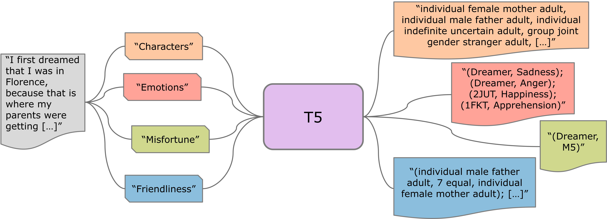

#  PreDA: Prefix-Based Dream Reports Annotation with Generative Language Models

 The repository contains the code to replicate the experiments and analysis presented in the paper.

## Tune models

Plase fined most of the fine-tuned models used in the experiments in the [JRC-AI](https://huggingface.co/jrc-ai) Hugging Face Page
